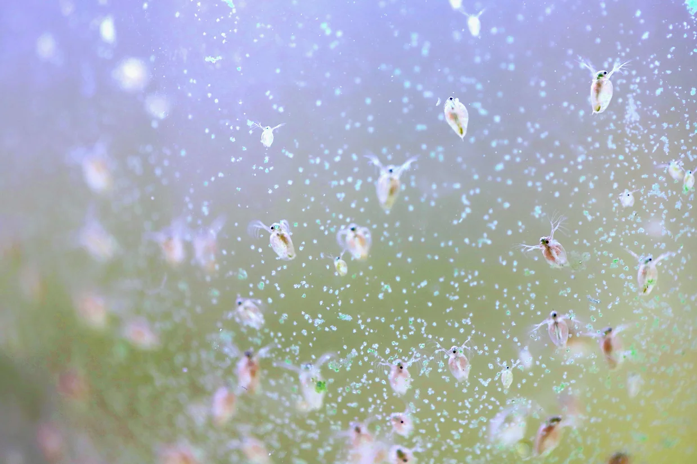

Modern computer vision often consists of throwing ever larger and more general
models at a problem, leading to small improvements in accuracy. Solutions often
leverage GPU hardware which is often expensive and power hungry.

But what about when there are significant constraints on energy? How can we optimise the model design process for this paradigm?

In my final project, I investigated how we can take what we know about the problem and the hardware to find bespoke solutions.
By doing this, we achieved a on the order of 1000x energy saving per frame compared to `YOLO11-nano`, a typical off-the-shelf solution.

## Motivation: Biohybrid Devices

[**Project robocoenosis**](https://www.robocoenosis.com/) is an ambitous attempt to build submersible
biohybrid devices that use living organsism for environmental sensing. The devices would be low-cost, autonomous and left in place for an extended time, allowing researchers to collect water quality data at a scale not achievable prevoiously.

To operate in these conditions, biohybrid devices harvest energy from the environment with microbial fuel cells (MFCs). These provide a small current, collected in capacitors until equipment can be turned on for a short period.

### Organisms as Sensors

Electronic chemical sensors have two main pitfalls for this project:

1. They are expensive
2. They are designed to sense specific chemicals. Novel pollutants might not be detected but could still be harmful

Tracking the changes in behavior of existing organisms mitigates both of these, similar to sniffer dogs or even [bees](https://pmc.ncbi.nlm.nih.gov/articles/PMC4697140/). Specifically, we aim to look at _Daphnia_ (water fleas) which spin around when they are stressed.

So, any computer vision technique used onboard must minimise the energy used such that data collection can be more frequent.
