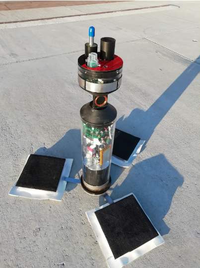
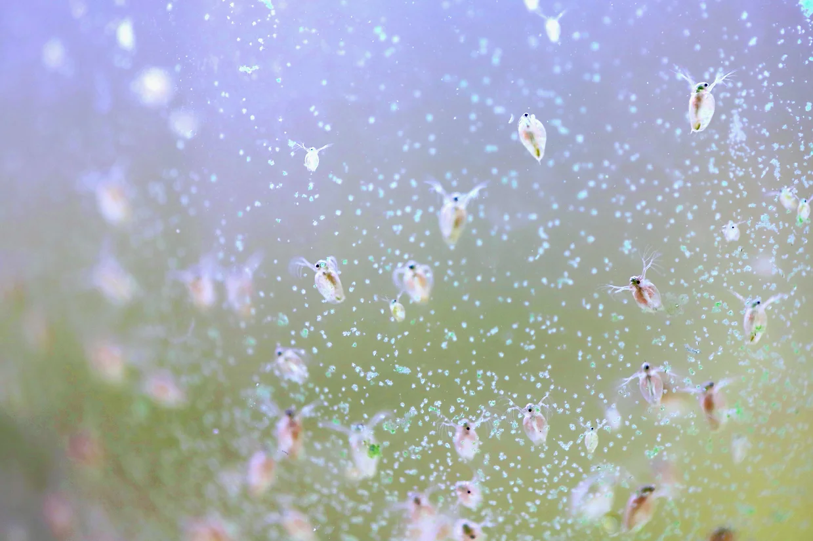

Modern computer vision often consists of throwing ever larger and more general
models at a problem, leading to small improvements in accuracy. Solutions often
leverage GPU hardware which is often expensive and power hungry.

But what about when there are significant constraints on energy? How can we optimise the model design process for this paradigm?

In my final project, I investigated how we can take what we know about the problem and the hardware to find bespoke solutions.
By doing this, we achieved a on the order of 1000x energy saving per frame compared to `YOLO11-nano`, a typical off-the-shelf solution.

## Motivation: Biohybrid Devices

[**Project robocoenosis**](https://www.robocoenosis.com/) is an ambitous attempt to build submersible
biohybrid devices that use living organsism for environmental sensing. The devices would be low-cost, autonomous and left in place for an extended time, allowing researchers to collect water quality data at a scale not achievable prevoiously.

### Organisms as Sensors

Electronic chemical sensors have two main pitfalls for this project:

1. They are expensive
2. They are designed to sense specific chemicals. Novel pollutants might not be detected but could still be harmful

Tracking the changes in behavior of existing organisms mitigates both of these, similar to sniffer dogs or even [bees](https://pmc.ncbi.nlm.nih.gov/articles/PMC4697140/). Specifically, we aim to look at _Daphnia_ (water fleas) which spin around when they are stressed.

So, any computer vision technique used onboard must minimise the energy used such that data collection can be more frequent.

### Engineering Constraints

To operate in these conditions, biohybrid devices harvest energy from the environment with microbial fuel cells (MFCs). These provide a small current, collected in capacitors until equipment can be turned on for a short period. Every millijoule counts, the less energy used, the more frequenlty data can be collected.

#### Edge Processing

- **High-frequency radio**: Can't penetrate water.
- **Low-frequency ratio**: Large, power-hungry transmitters, low data rate.
- **Acoustic communication**: Insufficient data rate for video.
- **Store and process later**: Not real time

## Rethinking Object Detection

Modern object detection can be really complex. SOTA models predict bounding boxes, use multiple feature scales, and are massivley deep. Since we only care about the position and movements patterns of _Daphnia_, which are all about the same size, we can relax the problem by **detecting keypoints instead of bounding boxes**.

## Hardware

For this project we used a Rasberry Pi 5, with a Hailo-8L NN accelerator. This was chosen as a suitable tradeoff between development easy, energy efficiency, and cost efficient. The methodology we use could be applied to other accelerator, ranging from tiny ARM Ethos chips to edge GPU devices like Nvidia Jetson.

Additionally, other onboard experiments already planned to use a Raspberry Pi.
